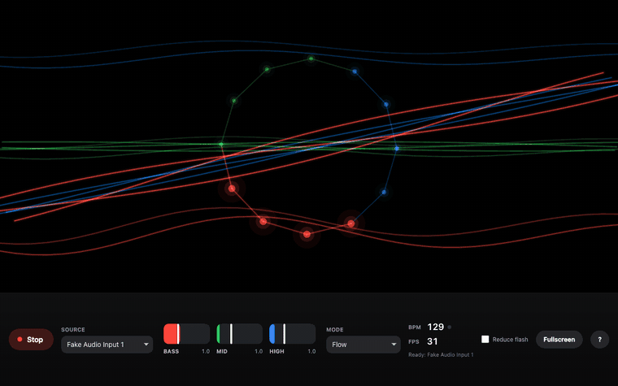
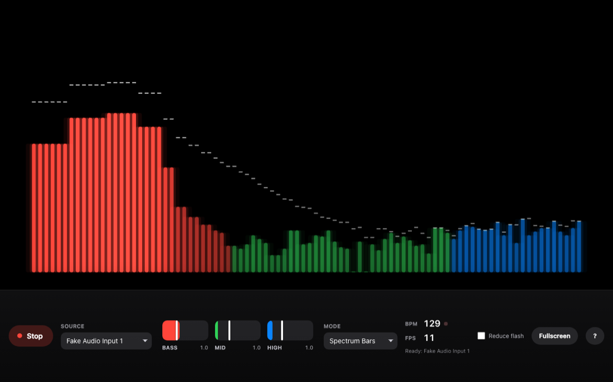
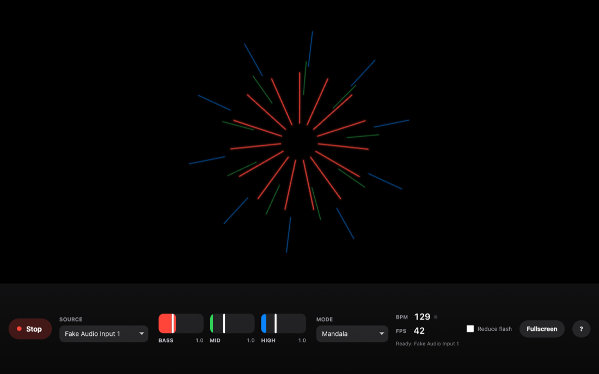

# DJ Visualizer

A web-based audio visualizer for DJs, built with plain JavaScript and the Web
Audio API. It listens to **live audio input from your hardware** — a controller,
a mixer, or a microphone — and turns it into projected visuals in real time.

It does not play audio files. There is no file to load and no track to select:
you plug in, press Start, and it reads the room.

Performed live at [Indy Hall](https://www.indyhall.org/) in Philadelphia, driving
real-time visuals off a Pioneer DDJ-REV1 in front of an audience.

## Demo



| Spectrum Bars | Mandala |
| --- | --- |
|  |  |

<sub>Captured by the verification suite against a generated test signal, which is
why the source reads "Fake Audio Input 1". Real hardware captures replace these
after the next DDJ check.</sub>

**Live build: [dj-visualizer.netlify.app](https://dj-visualizer.netlify.app)** —
deployed from `main`. It needs an audio input and microphone permission; with no
signal it will sit black, which is deliberate, not a fault. To drive it from DJ
hardware, run it locally with the steps below.

## What it does

- **Live hardware input.** Enumerates audio devices and prioritises DJ
  controllers (DDJ-REV1, then any DDJ, then Pioneer). Echo cancellation, noise
  suppression, and automatic gain control are all deliberately disabled so
  line-level signal from a mixer arrives unprocessed.
- **Three-band analysis.** Bass (20–250 Hz), mid (250 Hz–4 kHz), high
  (4–20 kHz), split by real frequency rather than by array position, with a
  per-band sensitivity control that doubles as a live meter.
- **Beat and BPM detection**, run on the audio thread so it holds steady when
  the visuals get heavy.
- **Ten visualization modes**, plus your own image, GIF, or video as a reactive
  layer.
- **Built for a stage**: fullscreen, keyboard shortcuts, on-screen BPM and FPS,
  and a reduced-flashing control for photosensitivity.

## Getting started

### Prerequisites

- A modern browser. Chrome is preferred for `getUserMedia` consistency and WebGL
  performance.
- An audio input. Any microphone works for trying it out.
- Node.js, only if you want to run the verification suite.

### Run it

```sh
git clone https://github.com/philaconvalley/djVisualizer.git
cd djVisualizer
python3 -m http.server 8000    # or: npx serve .
```

Open `http://localhost:8000`, pick a source, and press Start.

There is no build step and no runtime dependency to install. p5.js is vendored
in `vendor/` on purpose — the app must never need the network at showtime.

### Verify it

```sh
npm install       # devDependencies only
npm run verify
```

Runs the real app in Chromium against generated audio with known frequency
content: a 100 Hz tone must light bass and nothing else, a 120 BPM kick pattern
must read as 120, tempo must stay octave-correct from 85 to 174, and all ten
modes must paint without throwing. Screenshots
land in `test/output/`. See [CONTRIBUTING.md](CONTRIBUTING.md).

## Controls

| Key | Action |
| --- | --- |
| <kbd>Space</kbd> | Start / stop audio |
| <kbd>F</kbd> | Fullscreen |
| <kbd>1</kbd>–<kbd>9</kbd>, <kbd>0</kbd> | Switch visualization mode (0 selects the tenth) |
| <kbd>R</kbd> | Reset all sensitivities |
| <kbd>?</kbd> | Show or hide the controls panel |

## Photosensitivity

This visualizer produces full-field luminance changes in time with the music and
is designed to be projected. There is a **Reduce flash** control in the console;
it turns itself on automatically if your system asks for reduced motion, and it
can be overridden in either direction. If you are running this in front of an
audience, leave the warning on the start screen visible until you begin.

## Project structure

```
index.html              Markup, direction contract, script tags
app/
  app.js                Lifecycle, devices, controls, keyboard
  audioProcessor.js     Web Audio graph, band analysis, beat detection
  visualizer.js         All ten modes, one shared stage grammar
styles/styles.css       Design tokens and console styling
vendor/p5.min.js        Vendored p5 1.9.0 — never a CDN
docs/screenshots/       Demo GIF and mode screenshots used by this README
test/                   Verification harness (see CONTRIBUTING.md)
package.json            devDependencies and scripts for the harness only
LICENSE                 MIT
CONTRIBUTING.md         Constraints, verification, how to add a mode
PRODUCT.md              Users, constraints, product principles
DESIGN.md               Visual and behavioural decisions, and why
RESOURCES.md            Architecture reference, setup, troubleshooting
netlify.toml            Deployment config — Netlify is the only host
```

## Contributing

Contributions are welcome. Please read [CONTRIBUTING.md](CONTRIBUTING.md) first —
it covers the three constraints that shape every decision here (zero build, no
network at showtime, and the three-band concept), how to run the verification
suite, and how to add a visualization mode.

## License

MIT. See [LICENSE](LICENSE).

## Authors

- [traksaw](https://github.com/traksaw)

## Acknowledgments

- Built with the Web Audio API and [p5.js](https://p5js.org/)
- Inspired by the DJ and web audio community
